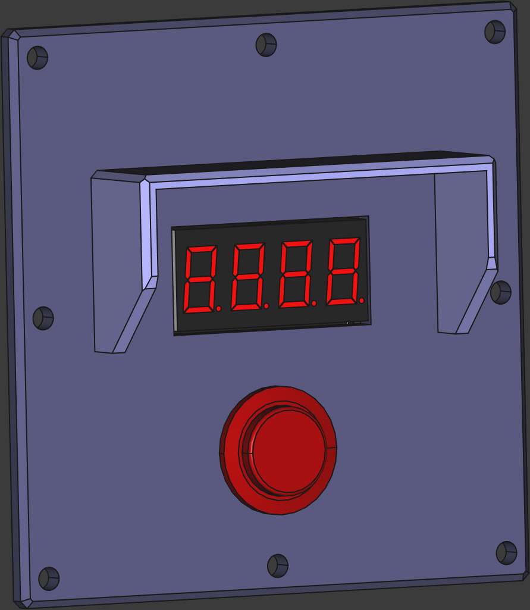

# 3D-Printed-Modular-Contorl-Panel
A customizable control panel kit aimed at mounting all them small sensors, lights, readouts, dials, and switches. This is a must have kit for any development board owner, as your project continues to evolve, well so can your panel. Rack um, Stack um, and Pack um.

images comming sooooon!!

Thingiverse: https://www.thingiverse.com/thing:7019983

